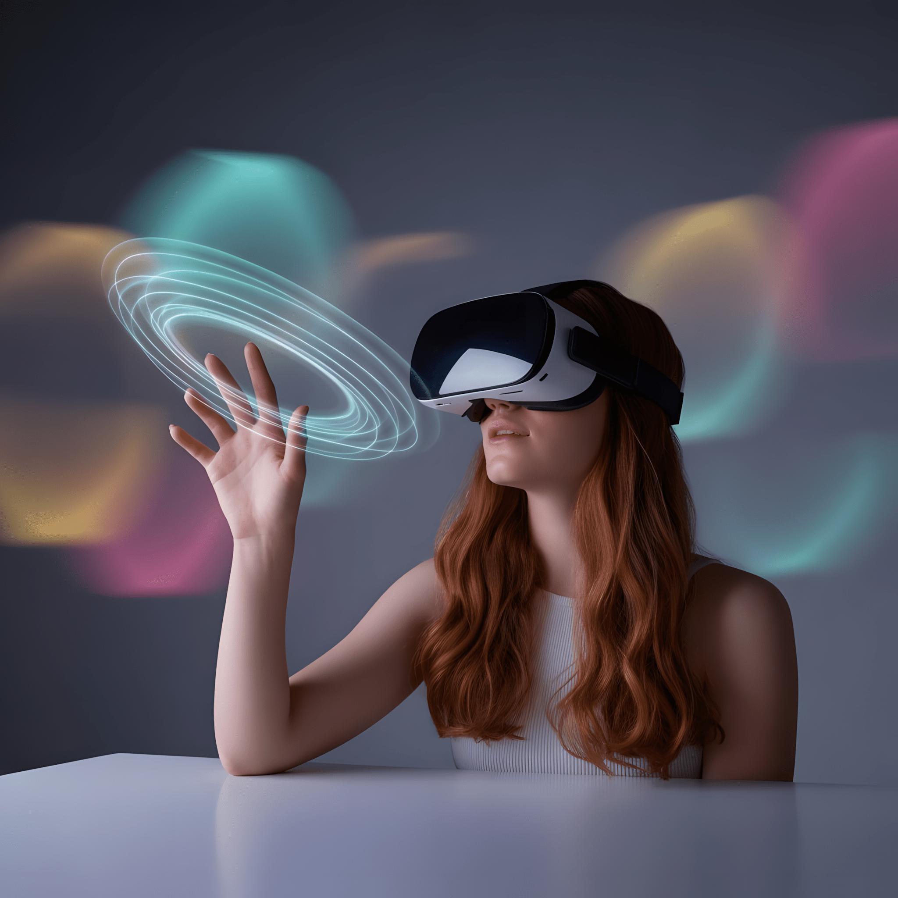
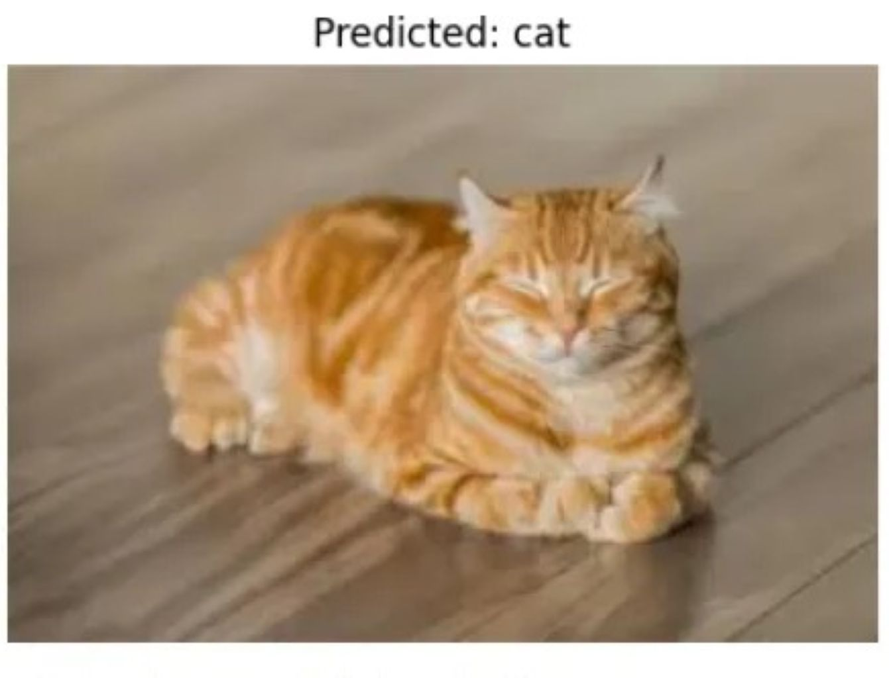
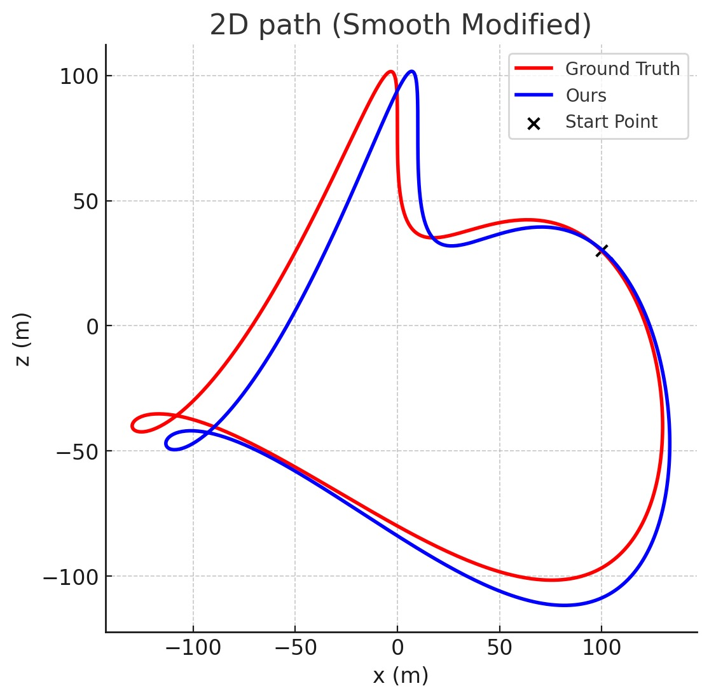

# XR-NPE
This repository is part of the work presented in:

XR-NPE: High-Throughput Mixed-Precision SIMD Neural Processing Engine for Extended Reality Perception Workloads

## Comprehensive visualization for different eXtended Reality technologies
<table>
<tr>
<td align="center"><br><b>Augmented-Reality</b></td>
<td align="center"><br><b>Virtual-Reality</b></td>
<td align="center"><br><b>Mixed-Reality</b></td>
</tr>
</table>
## Multi-Precision Quantization for Vision and Sensor Fusion Models

This repository provides Python implementations of **multi-precision quantization** for various computer vision and sensor fusion workloads.  
It has three workloads:  
- [`Gaze-LLE`](./Gaze-LLE/README.md) – Eye gaze extraction
- [`ResNet`](./Resnet/README.md) – Image classification
- [`EfficientNet`](./EfficientNet/README.md) – Image classification 
- [`UL-VIO`](./UL-VIO/README.md) – Visual-Inertial Odometry 

The code supports the following quantization formats:
- **FP4**  
- **FP8**  
- **Posit4**   
- **Posit8**
- **Posit16**  
- **BF16**
- **Mixed-Precision**

This  facilitates  researchers and practitioners to explore the **trade-offs across accuracy, latency, and resource usage**.

---

## Key Results:
- 42% area and 38% power reduction compared to SoTA MAC engines.
- 23% higher energy efficiency for VIO workloads.
- 4% better compute density at CMOS 28nm.
## Features  
- **Layer-Adaptive Mixed-Precision** quantization (FP4/Posit/Mixed Precision).  
- **Reduced memory bandwidth** with extreme compression (up to **4.2× smaller models**).  
- **Reconfigurable Mantissa Multiplication & Exponent Circuitry (RMMEC)** for dark-silicon reduction.  
- **2.85× improved arithmetic intensity** compared to state-of-the-art MAC engines.  
- **Hardware + Algorithm co-design** (FPGA/ASIC friendly).  

---

## Repository Structure
```text
XR-NPE/
│
├── Gaze-LLE/   # Eye gaze estimation quantization — BF16, FP4, FP8, Posit4, Posit8
│
├── Resnet/     # ResNet image classification quantization — BF16, FP4, FP8, Posit8
│
├── Efficientnet/     # ResNet image classification quantization — BF16, FP4, FP8, Posit8
│
├── UL-VIO/     # Visual–Inertial Odometry quantization — BF16+INT8, FP4, FP8, Mixed Precision (Posit8+FP4), Posit4/8/16
│
└── README.md   # Generic README
```
---

## Installation

Clone the repository:
```bash
git clone https://github.com/XXXXXXXXXXXXXXXX/XR-NPE.git
cd XR-NPE
pip install -r requirements.txt
pip install -r requirements_extra.txt  #for some additional library might be used
```
## Model Output Previews
<table>
<tr>
<td align="center"><br><b>Gaze-LLE</b></td>
<td align="center"><br><b>ResNet</b></td>
<td align="center"><br><b>UL-VIO</b></td>
</tr>
</table>

## References
- [Gaze-LLE](https://github.com/fkryan/gazelle)
- [ResNet](https://github.com/JayPatwardhan/ResNet-PyTorch)
- [UL-VIO](https://github.com/jp4327/ulvio)
