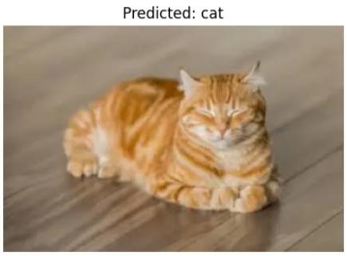

# XR-NPE
## Multi-Precision Quantization for Vision and Sensor Fusion Models

This repository provides Python implementations of **multi-precision quantization** for various computer vision and sensor fusion workloads.  
It has three workloads:  
- [`Gaze-LLE`](./Gaze-LLE) – Eye gaze extraction
- [`ResNet`](./Resnet) – Image classification
- [`UL-VIO`](./UL-VIO) – Visual-Inertial Odometry 

The code supports the following quantization formats:
- **FP4**  
- **FP8**  
- **Posit4** (Posit(4,1))  
- **Posit8** (Posit(8,0))  
- **BF16**
- **Mixed-Precision**

This  facilitates  researchers and practitioners to explore the **trade-offs across accuracy, latency, and resource usage**.

---

## 📂 Repository Structure
```text
multi-precision-quantization/
│
├── Gaze-LLE/   # Eye gaze estimation quantization — BF16, FP4, FP8, Posit4, Posit8
│
├── Resnet/     # ResNet image classification quantization — BF16, FP4, FP8, Posit8
│
├── UL-VIO/     # Visual–Inertial Odometry quantization — BF16+INT8, FP4, FP8, Mixed Precision (Posit8+FP4), Posit4/8/16
│
└── README.md   # Generic README
```
---

## ⚙️ Installation

Clone the repository:
```bash
git clone https://github.com/XXXXXXXXXXXXXXXX/XR-NPE.git
cd XR-NPE
pip install -r requirements.txt
pip install -r requirements_extra.txt  #for some additional library might be used
```
## Model Output Previews
<table>
<tr>
<td align="center"><br><b>Gaze-LLE</b></td>
<td align="center"><br><b>ResNet</b></td>
<td align="center"><br><b>UL-VIO</b></td>
</tr>
</table>

## 🔗 References
- [Gaze-LLE](https://github.com/fkryan/gazelle)
- [ResNet](https://github.com/JayPatwardhan/ResNet-PyTorch)
- [UL-VIO](https://github.com/jp4327/ulvio)
