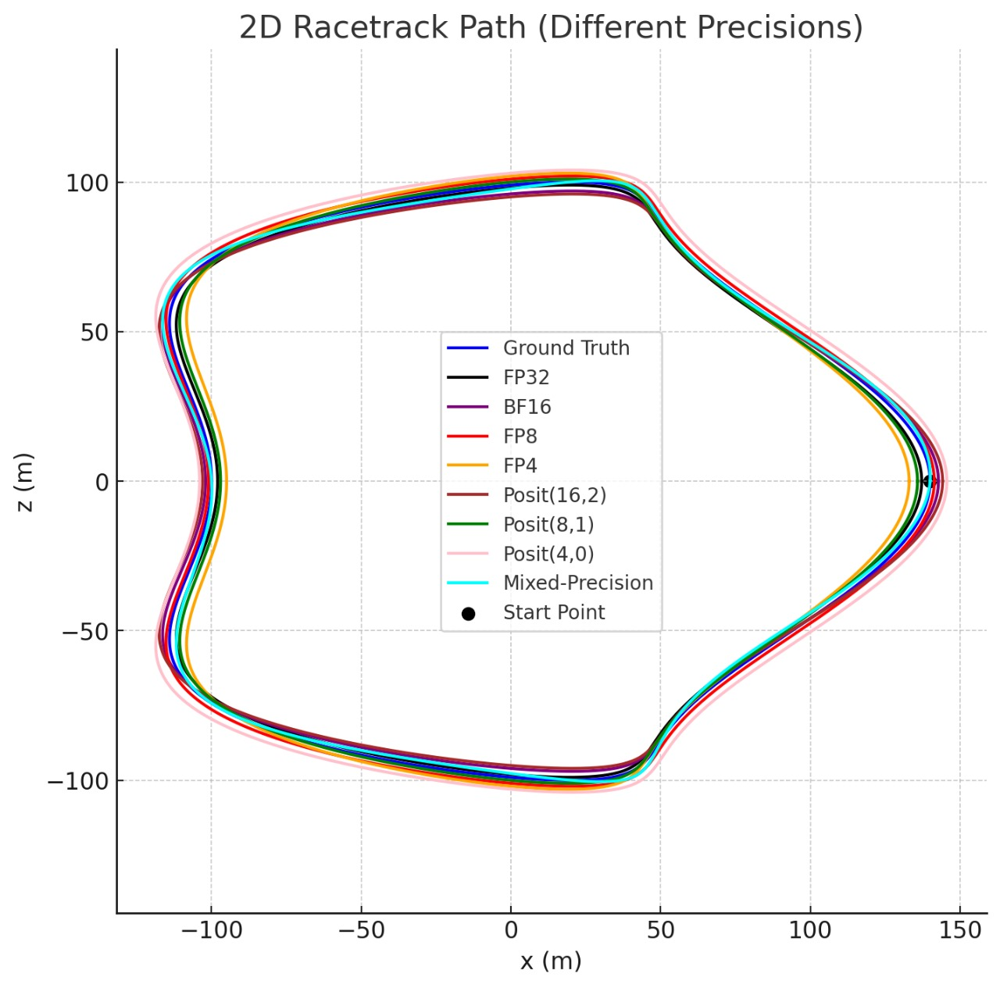
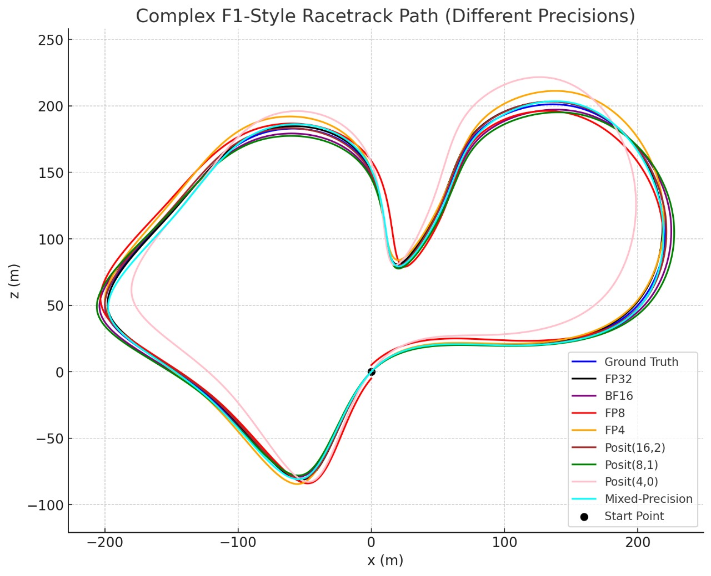

# UL-VIO: Noise-Robust Visual-Inertial Odometry Across Numerical Precisions

  
**Figure:** UL-VIO framework overview. The system fuses RGB imagery and IMU data to estimate motion trajectories, remaining robust even under quantization and sensor noise.

---

## Introduction  

**UL-VIO** is a Visual-Inertial Odometry (VIO) framework built for **robustness under extreme quantization and sensor noise**.  
It uses **Noise-Robust Test-Time Adaptation (NR-TTA)** to adapt on-the-fly, making it practical for **low-power edge devices** without sacrificing much accuracy.  

**Key highlights:**  
- Fuses **RGB + IMU data** for reliable motion estimation.  
- Adapts to shifts caused by **quantization and noise**.  
- Supports a range of numerical precisions, from IEEE floating point to **Posit formats**.  

---

## Racetrack Path Experiments  

To test UL-VIO’s resilience under quantization, we simulated **racetrack-style trajectories**.  
These controlled environments let us see how precision impacts path accuracy.  

### Tracks  

1. **Horse Race Track (2D loop)** – Smooth track with gradual turns.  
2. **Formula 1-Style Track** – A more demanding circuit with sharp curves and steep sections.  

### Precisions Evaluated  

- **Floating Point:** FP32, BF16, FP8, FP4  
- **Posit Formats:** Posit(16,2), Posit(8,1), Posit(4,0)  
- **Mixed Precision:** Hybrid approach using multiple precisions  

---

## Results  

- **Ground Truth (blue)** is the reference trajectory.  
- **High precision (FP32, BF16, Posit(16,2))** nearly overlaps with ground truth.  
- **Low precision (FP4, Posit(4,0))** shows more deviation, especially on the Formula 1 track.  
- **Mixed Precision** offers a good balance between efficiency and accuracy.  

#### Horse Race Track  

  

- Minimal degradation across precisions.  
- Even **FP4** and **Posit(4,0)** stay close to the reference path with only rare deviations.  

#### Formula 1-Style Track  

  

- Sharper turns reveal quantization effects.  
- **Posit(4,0)** and **FP4** drift significantly.  
- **FP8, Posit(8,1), and Mixed Precision** remain stable and accurate.  

---

## Why Quantization Matters  

Standard VIO models rely on **FP32/FP16**, which are too costly for embedded devices.  
Quantization enables deployment on **resource-constrained platforms** like AR glasses, drones, and mobile robots by reducing:  

- **Latency**  
- **Power consumption**  
- **Memory usage**  

UL-VIO addresses this by:  
- Supporting **FP32, FP16, BF16, FP8, FP4, and Posit(4/8/16)**.  
- Preserving **translational & rotational accuracy** even at low precision.  
- Using **NR-TTA** to counter quantization-induced drift.  

---

## KITTI Quantization Experiments  

We further validated UL-VIO on KITTI odometry with multiple quantization settings:  

| Precision      | Translational Error (%) | Rotational Error (%) |
|----------------|--------------------------|-----------------------|
| FP32           | 2.18%                   | 0.52%                 |
| Posit(4,0)     | 2.75%                   | 0.62%                 | 
| Posit(8,1)     | 2.50%                   | 0.58%                 | 
| Posit(16,2)    | 2.20%                   | 0.55%                 | 
| FP4 (E2M1)     | 2.90%                   | 0.65%                 | 
| Posit(8,1)+FP4 | 2.36%                   | 0.56%                 |  

**Key takeaway:** NR-TTA makes **sub-INT8 precision practical**, cutting error and improving stability.  

---

## Repository Structure  

**Notebooks:**  
- `FP4.ipynb` — FP4 evaluation  
- `FP8.ipynb` — FP8 evaluation  
- `BF16INT8.ipynb` — BF16 and INT8 evaluation  
- `Posit4_8_16.ipynb` — Posit formats evaluation  
- `Posit8+FP4.ipynb` — Mixed-precision evaluation  

**Assets:**  
- `assets/vio_precision_error.png` — Summary plot of errors across precisions  

---

## Key Takeaways  

- **UL-VIO holds up surprisingly well—even with FP4—when paired with NR-TTA.**  
- Designing with quantization in mind is essential for **edge deployment**.  
- **Posit formats** can outperform IEEE FP in noisy conditions, offering a path to **efficient and robust VIO** on low-power hardware.  

---

## Citation  

```bibtex
@article{park2024ulvio,
      author    = {Park, Jinho and Chun, Se Young and Seok, Mingoo},
      title     = {UL-VIO: Ultra-lightweight Visual-Inertial Odometry with Noise Robust Test-time Adaptation},
      journal   = {ECCV},
      year      = {2024},
}

@article{yang2022efficient,
      title={Efficient Deep Visual and Inertial Odometry with Adaptive Visual Modality Selection},
      author={Yang, Mingyu and Chen, Yu and Kim, Hun-Seok},
      journal={arXiv preprint arXiv:2205.06187},
      year={2022}
}
