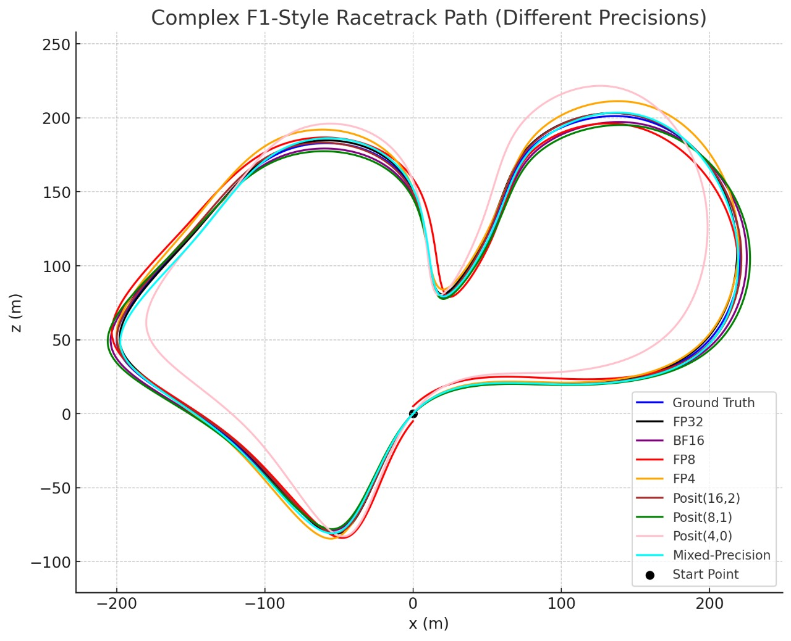

# UL-VIO: Noise-Robust Visual-Inertial Odometry Across Numerical Precisions

  
**Figure:** UL-VIO framework overview. The system fuses RGB imagery and IMU data to estimate motion trajectories, remaining robust even under quantization and sensor noise.

---

## Introduction  

**UL-VIO** is a Visual-Inertial Odometry (VIO) framework designed for **robustness under extreme quantization and sensor noise**.  
It leverages **Noise-Robust Test-Time Adaptation (NR-TTA)** to adapt on-the-fly, enabling deployment on **low-power edge devices** without significant loss in accuracy.  

Key highlights:  
- Fuses **RGB + IMU data** for motion estimation.  
- Adapts to distribution shifts caused by **quantization + noise**.  
- Supports **multiple precisions**, including IEEE FP and **Posit formats**.  

---

## UL-VIO Racetrack Path Experiments (Quantized Models)  

To analyze UL-VIO’s resilience under quantization, we tested the system on **synthetic racetrack-style paths**.  
These controlled environments highlight how **precision impacts trajectory accuracy**.  

### Tracks Used  

1. **Horse Race Track (2D loop)** – A smooth track with gradual turns.  
2. **Complex F1-Style Track** – A challenging circuit with sharp turns and high variability.  

### Precisions Evaluated  

- **Floating Point:** FP32, BF16, FP8, FP4  
- **Posit Formats:** Posit(16,2), Posit(8,1), Posit(4,0)  
- **Mixed Precision:** Combining higher and lower precision arithmetic  

### Results  

- **Ground Truth (blue)** is the reference path.  
- **High precision (FP32, BF16, Posit(16,2))** matches ground truth closely.  
- **Low precision (FP4, Posit(4,0))** shows noticeable drifts, especially on the F1-style track.  
- **Mixed Precision** balances **efficiency and accuracy**, maintaining reliable performance.  

#### Horse Race Track (2D Path)  

  

- Minimal degradation across precisions.  
- Even **FP4** and **Posit(8,1)** follow the ground truth closely.  

#### Complex F1-Style Track  

  

- Sharper curves reveal quantization errors.  
- **Posit(4,0)** and **FP4** deviate significantly.  
- **FP8, Posit(8,1), and Mixed Precision** still preserve navigation accuracy.  

---

## Why Quantization Matters for VIO  

Traditional VIO relies on **FP32/FP16**, which can be expensive on embedded devices.  
Quantization enables deployment on **resource-constrained platforms** (e.g., AR glasses, drones, mobile robots) by reducing:  

- Latency  
- Power consumption  
- Memory footprint  

UL-VIO addresses these challenges by:  
- Supporting **FP32, FP16, BF16, FP8, FP4, and Posit(4/8/16)**.  
- Preserving **translational & rotational accuracy** across precisions.  
- Using **NR-TTA** to mitigate quantization-induced noise and drift.  

---

## Quantization Experiments (KITTI Odometry)  

We systematically evaluated UL-VIO under various quantization settings:  

| Precision      | Translational Error (%) | Rotational Error (%) |
|----------------|--------------------------|-----------------------|
| FP32           | 2.18%                   | 0.52%                 |
| Posit(4,0)     | 2.75%                   | 0.62%                 | 
| Posit(8,1)     | 2.50%                   | 0.58%                 | 
| Posit(16,2)    | 2.20%                   | 0.55%                 | 
| FP4 (E2M1)     | 2.90%                   | 0.65%                 | 
| Posit(8,1)+FP4 | 2.36%                   | 0.56%                 |  

**Key Finding:** NR-TTA makes **sub-INT8 precision viable** by reducing quantization + noise degradation.  

---

## Repository Structure  

### Quantization Evaluation Notebooks  
- `FP4.ipynb` — FP4 evaluation  
- `FP8.ipynb` — FP8 evaluation  
- `BF16INT8.ipynb` — BF16 and INT8 evaluation  
- `Posit4_8_16.ipynb` — Posit formats evaluation  
- `Posit8+FP4.ipynb` — Mixed-precision experiment  

### Assets  
- `assets/vio_precision_error.png` — Summary plot of errors across precisions  

---

## Key Takeaways  

- UL-VIO maintains competitive accuracy even under **FP4 quantization** when combined with NR-TTA.  
- **Quantization-aware evaluation** is essential for realistic edge deployment scenarios.  
- **Posit formats** can outperform IEEE FP in noisy conditions, suggesting further efficiency opportunities in VIO systems.  

---

## Citation  

```bibtex
@article{park2024ulvio,
      author    = {Park, Jinho 
                  and Chun, Se Young 
                  and Seok, Mingoo},
      title     = {UL-VIO: Ultra-lightweight Visual-Inertial Odometry with Noise Robust Test-time Adaptation},
      journal   = {ECCV},
      year      = {2024},
}

@article{yang2022efficient,
      title={Efficient Deep Visual and Inertial Odometry with Adaptive Visual Modality Selection},
      author={Yang, Mingyu and Chen, Yu and Kim, Hun-Seok},
      journal={arXiv preprint arXiv:2205.06187},
      year={2022}
}
